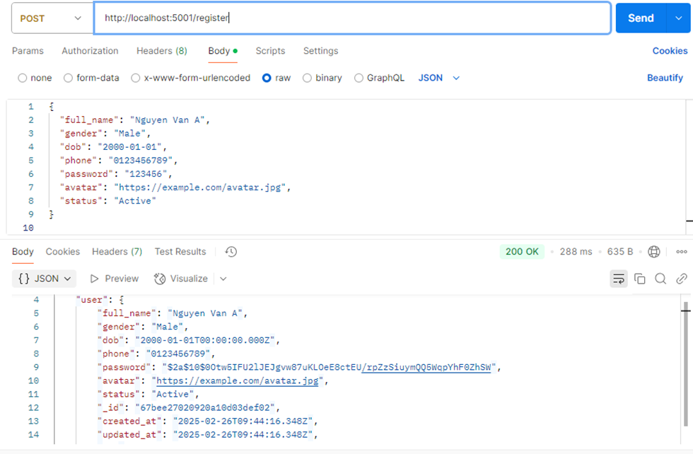
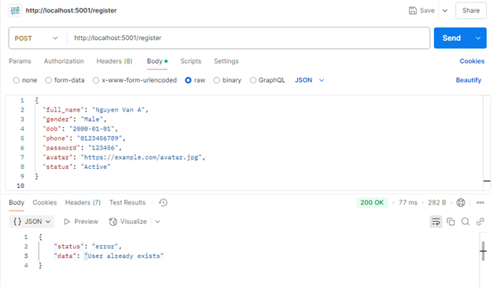
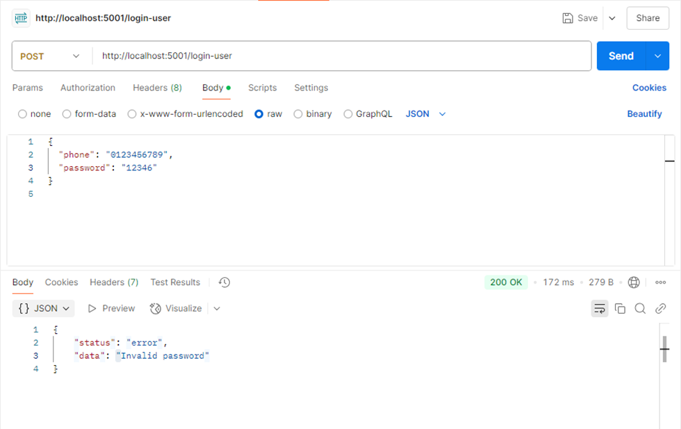
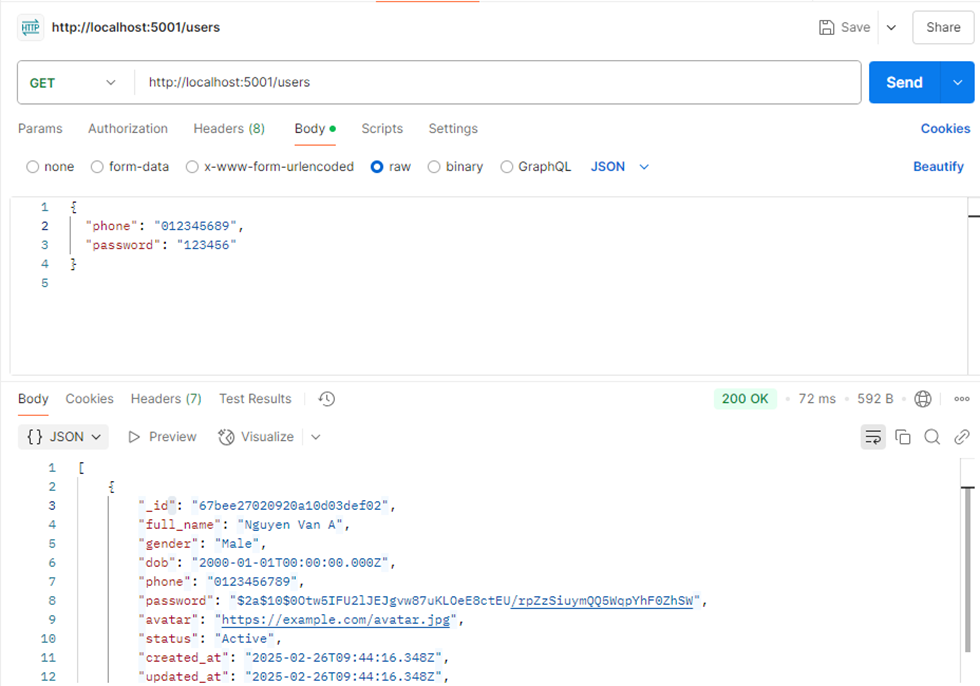

## Register:

POST:

```
 http://localhost:5001/register
```

success

Failure


## Login

POST:

```
	http://localhost:5001/login-user
```

Success

Failure:



## Lấy danh sách user

GET: http://localhost:5001/users


## Lấy thông tin user từ token:

• POST

```
 http://localhost:5001/userdata
```


